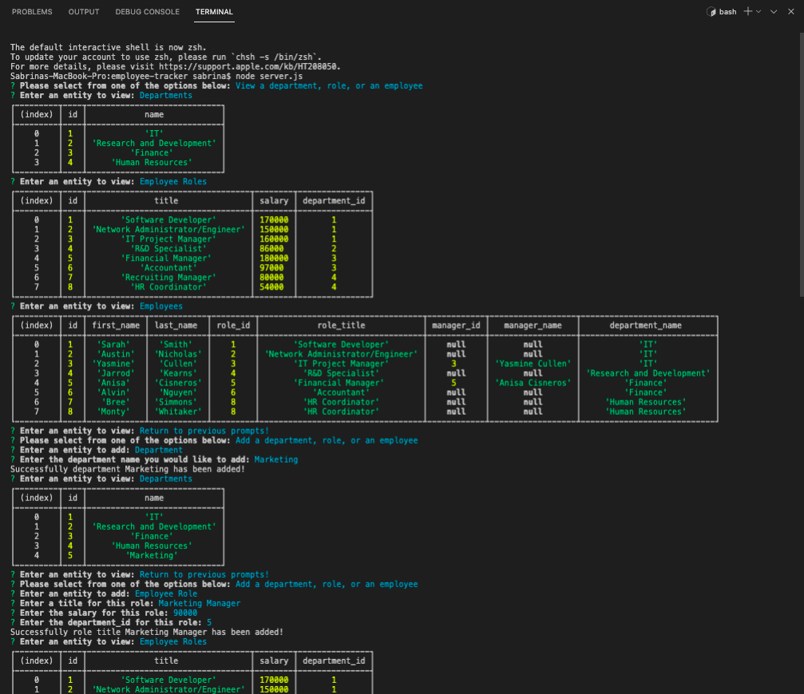
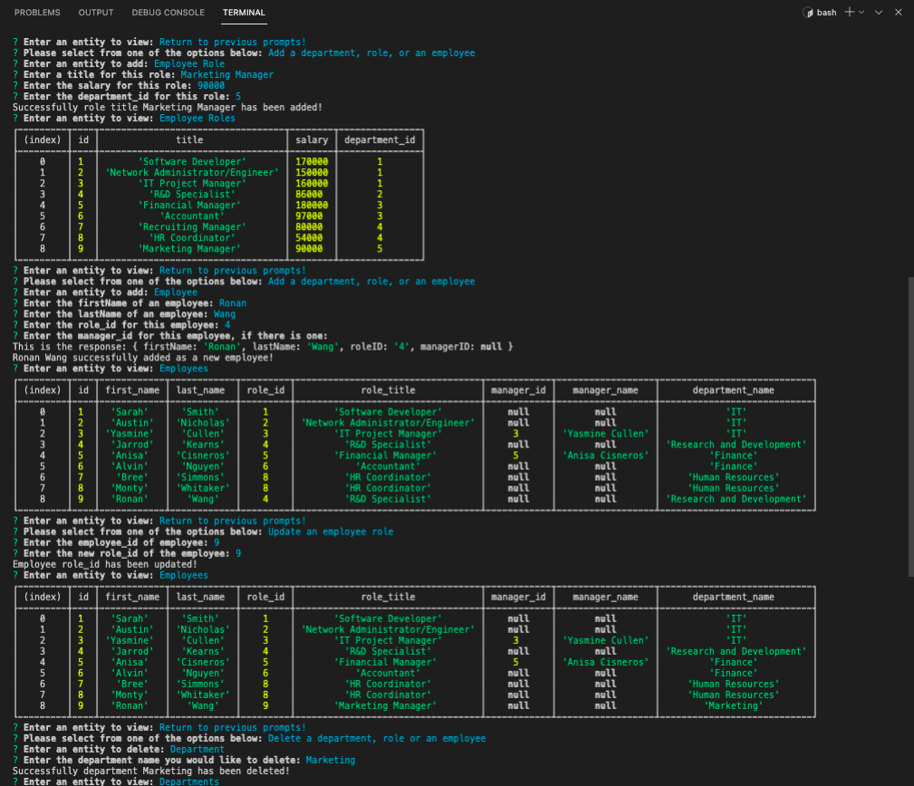
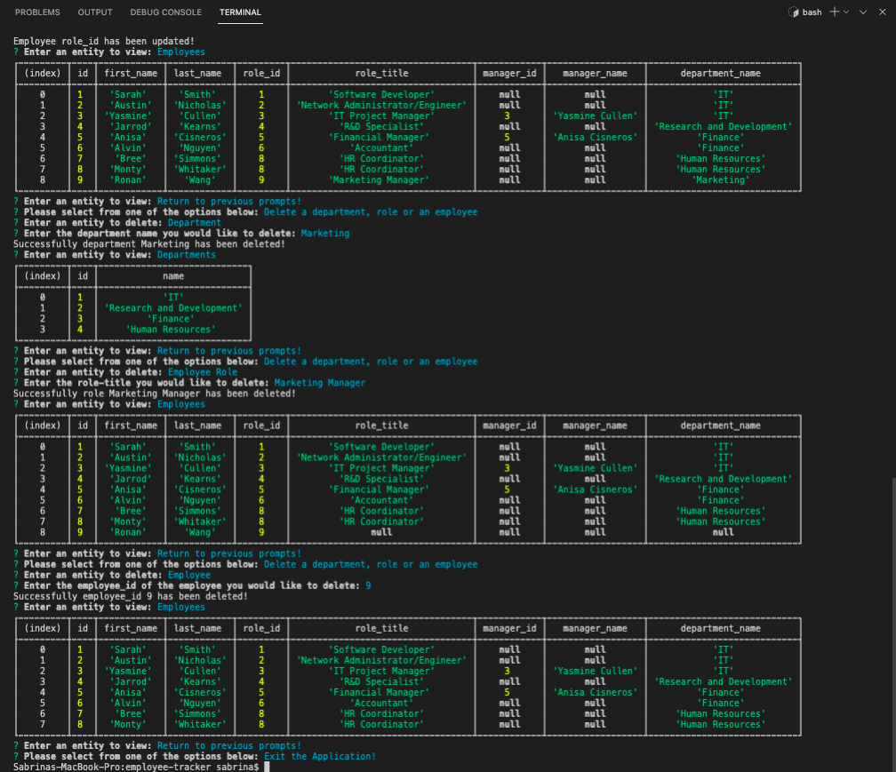

# employee-tracker


[](https://opensource.org/licenses/MIT)


## Table of Contents
- [Description](#Description)
- [Screenshots](#Screenshots)
- [User Story](#User-Story)
- [Acceptance Criteria](#Acceptance-Criteria)
- [Demo Link](#Demo-Link)


## Description 
The Employee Tracker command-line application allows for non-developers to view and interact with information stored in databases. The core of this interface was to architect and build a solution for managing a company's employees using node, inquirer, and MySQL. 


## Screenshots





## User Story 
```
As a business owner
I want to be able to view and manage the departments, roles, and employees in my company
So that I can organize and plan my business
```


## Acceptance Criteria

```
Build a command-line application that at a minimum allows the user to:

  * Add departments, roles, employees

  * View departments, roles, employees

  * Update employee roles

Bonus points if you're able to:

  * Update employee managers

  * View employees by manager

  * Delete departments, roles, and employees

  * View the total utilized budget of a department -- ie the combined salaries of all employees in that department
```


## Demo Link 
[Employee Tracker Demo](https://drive.google.com/file/d/1lODV-5bkLowq8oe0L7RIsw_-fo252FSE/view?usp=sharing)